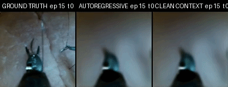

# Surgical JEPA for HackTheWorld(s)

This repository is our hackathon fork of
[EB-JEPA](https://github.com/Trick5t3r/eb_jepa), the open-source library from
the paper
[A Lightweight Library for Energy-Based Joint-Embedding Predictive Architectures](https://arxiv.org/abs/2602.03604).

The goal was not to make another generic EB-JEPA example. We wanted to see if
the action-conditioned video JEPA setup could become a small surgical world
model: take wrist-camera video from a robot, encode it into a latent state,
condition the predictor on proprioception, and roll the scene forward without
training directly in pixel space.

We used the
[PhysicalAI-Robotics-Open-H-Embodiment](https://huggingface.co/datasets/nvidia/PhysicalAI-Robotics-Open-H-Embodiment)
dataset, specifically the `Surgical/hamlyn/suturing_2` subset.

<p align="center">
  
  <br>
  <i>Ground truth, autoregressive rollout, and clean-context prediction.</i>
</p>

## What We Built

Our contribution lives mostly in `examples/surgical_jepa`, with a few reusable
changes in the core library.

- `eb_jepa/datasets/open_h` adds a LeRobot v2.1 reader without depending on
  LeRobot itself. It reads the episode metadata, Parquet proprioception tables,
  and MP4 videos directly.
- The dataset returns 17-frame RGB wrist-camera clips at 5 fps, resized to
  `128x128`, plus 32-D action conditioning vectors of the form
  `[proprio_t, proprio_t+1]`.
- Complete episodes are held out, and proprioception normalization statistics
  are fit only on the remaining train episodes.
- `eb_jepa/jepa.py` now lets sequence predictors start autoregressive rollout
  from one real frame and grow their context window as predictions are appended.
- `eb_jepa/architectures.py` adds a causal action-conditioned Transformer
  predictor with AdaLN-Zero conditioning.
- We also tried a DINOv3 ConvNeXt encoder that projects pretrained patch tokens
  back into the standard EB-JEPA `[B,D,T,1,1]` latent format.
- Pixels are used only after JEPA training: we freeze the JEPA, train a small RGB
  decoder, and evaluate decoded rollouts with LPIPS.

## Models We Tried

The baseline is close to the original AC-JEPA setup: IMPALA encoder, GRU latent
predictor, VC/IDM anti-collapse regularization, and 8-step autoregressive
training.

The two main variants were:

- **Transformer predictor:** a compact 4-layer causal Transformer, conditioned
  on embedded proprioception with AdaLN-Zero. During rollout it starts from one
  real latent and can use up to four previous predicted latents.
- **DINOv3 encoder:** `facebook/dinov3-convnext-tiny-pretrain-lvd1689m` as the
  image encoder, with a learned projection into the EB-JEPA latent.

The evaluation compares two modes:

- **Autoregressive:** every future latent is predicted from generated context.
- **Clean context:** each future latent is predicted from clean encoded context.

The gap between the two is useful because it measures how much error compounds
when the model has to live with its own predictions.

## Ablations

The table below is copied from [`docs/ablations.xlsx`](docs/ablations.xlsx).
Lower LPIPS is better. `Gap Clean/AR` is the extra LPIPS paid by using generated
latent context instead of clean encoded context, so lower is also better.
`Mean perf. change` is the spreadsheet's relative average vs. the baseline
across AR LPIPS, gap, and the horizon LPIPS columns; positive means better than
baseline.

| Run | AR LPIPS | Gap Clean/AR | LPIPS @ 0.2s | LPIPS @ 1s | LPIPS @ 2s | Mean perf. change |
| --- | ---: | ---: | ---: | ---: | ---: | ---: |
| Collapse (no reg term) | 0.575 | 0.026 | 0.549 | 0.550 | 0.587 | - |
| Baseline (EB-JEPA) | 0.470 | 0.020 | 0.446 | 0.448 | 0.480 | - |
| `W_Cov=0` | 0.507 | 0.010 | 0.495 | 0.497 | 0.512 | +2.7% |
| `W_Std=0` | 0.530 | 0.009 | 0.519 | 0.520 | 0.536 | -0.4% |
| `W_Sim=0` | 0.465 | 0.026 | 0.435 | 0.438 | 0.478 | -4.8% |
| `W_Idm=0` | 0.476 | 0.021 | 0.450 | 0.454 | 0.488 | -2.0% |
| DINOv3 Encoder | 0.478 | 0.014 | 0.450 | 0.466 | 0.475 | +4.7% |
| Transformer Predictor | 0.476 | 0.007 | 0.435 | 0.438 | 0.450 | +14.9% |

What we take from this:

- The no-regularization run collapses badly enough to make the point: AR LPIPS
  goes from `0.470` to `0.575`.
- Removing temporal similarity gives the best raw mean AR LPIPS (`0.465`) and
  strong short-horizon numbers, but it increases the clean/AR gap. That looks
  like a nicer one-step model, not necessarily a safer rollout model.
- The Transformer predictor is the coolest result. It does not win on mean AR
  LPIPS, but it cuts the compounding gap from `0.020` to `0.007` and improves
  LPIPS at 2 seconds from `0.480` to `0.450`.
- DINOv3 helped the gap but was not a free win on the horizon metrics. With more
  tuning it might still be worth revisiting, but for this hackathon the
  Transformer change is the cleaner story.

## Running It

First update `data.data_root` in the selected config so it points to your
Open-H `Surgical/hamlyn/suturing_2` directory.

```bash
# Check the dataset and generate sample previews
uv run python -m examples.surgical_jepa.test_dataset --num-previews 3

# Train the IMPALA + GRU baseline
uv run python examples/surgical_jepa/main.py \
  --fname examples/surgical_jepa/train.yaml

# Train the Transformer predictor variant
uv run python examples/surgical_jepa/main.py \
  --fname examples/surgical_jepa/train_transformer.yaml

# Train the DINOv3 encoder variant
uv run python examples/surgical_jepa/main.py \
  --fname examples/surgical_jepa/train_ConvNeXt.yaml

# Train the RGB decoder from a JEPA checkpoint
uv run python examples/surgical_jepa/train_decoder.py \
  --jepa_checkpoint /path/to/jepa/best.pth.tar

# Evaluate decoded rollouts
uv run python examples/surgical_jepa/evaluation.py \
  --checkpoint /path/to/decoder/best.pth.tar
```

## Citation

This work is built on EB-JEPA. If you use this repo, please cite the original
library:

```bibtex
@misc{terver2026lightweightlibraryenergybasedjointembedding,
      title={A Lightweight Library for Energy-Based Joint-Embedding Predictive Architectures},
      author={Basile Terver and Randall Balestriero and Megi Dervishi and David Fan and Quentin Garrido and Tushar Nagarajan and Koustuv Sinha and Wancong Zhang and Mike Rabbat and Yann LeCun and Amir Bar},
      year={2026},
      eprint={2602.03604},
      archivePrefix={arXiv},
      primaryClass={cs.CV},
      url={https://arxiv.org/abs/2602.03604},
}
```
